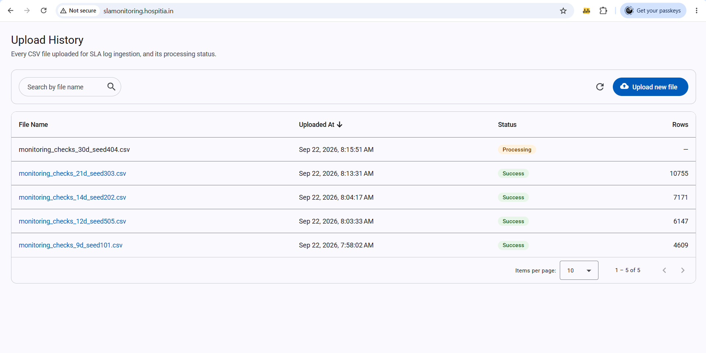
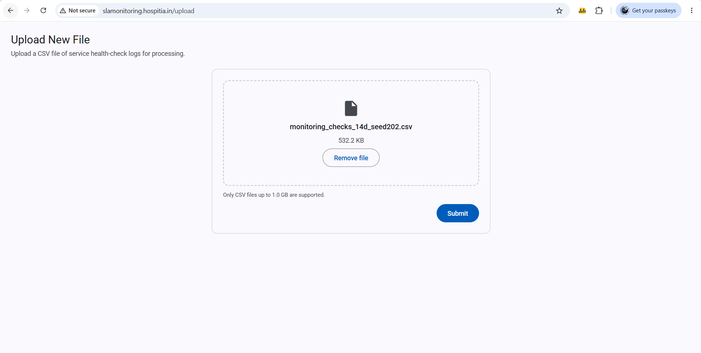
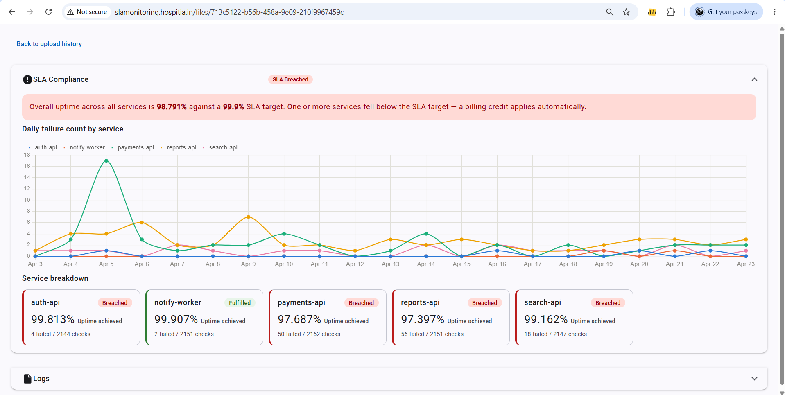
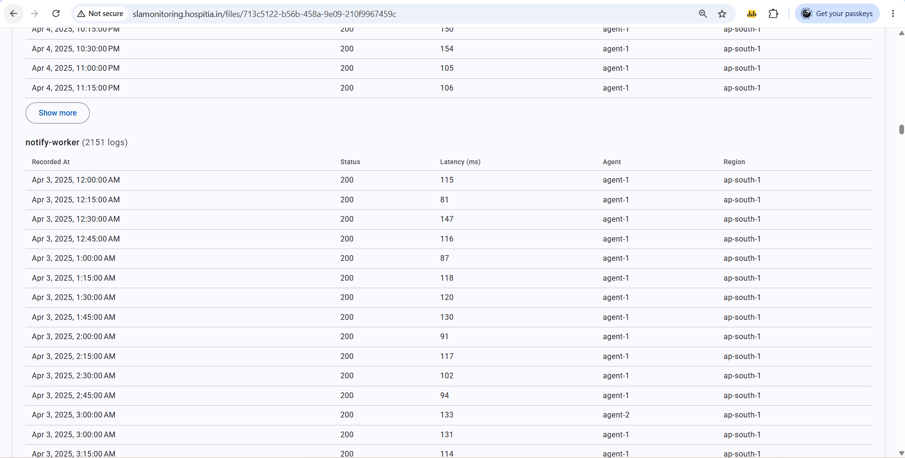
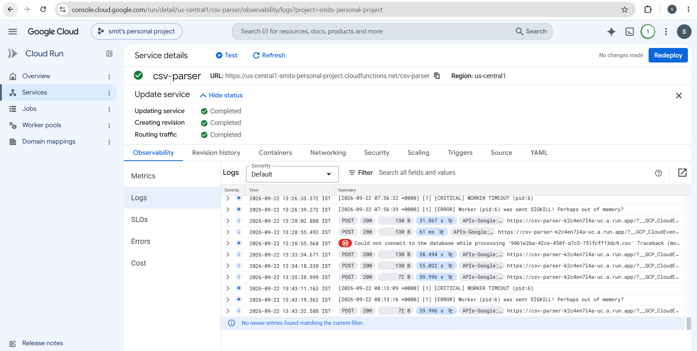
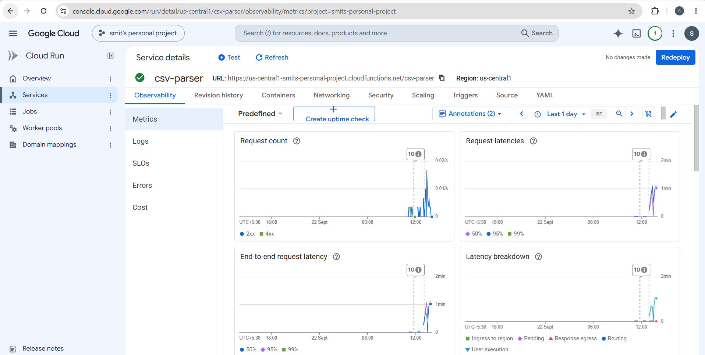
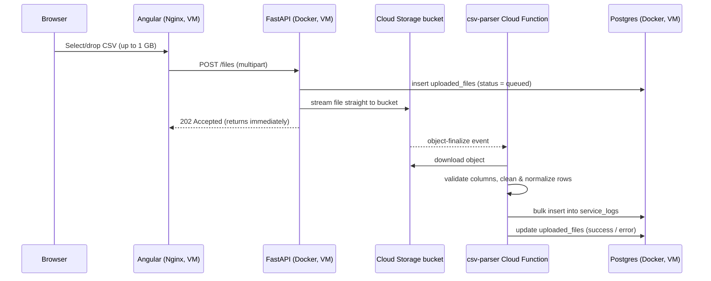
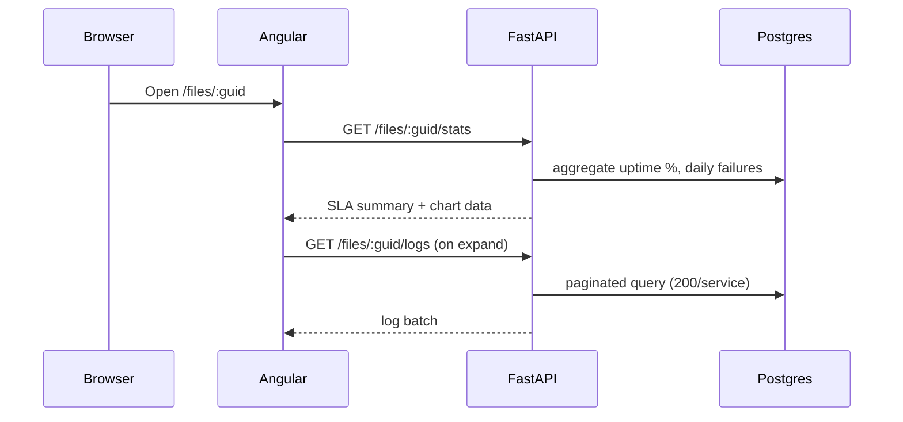
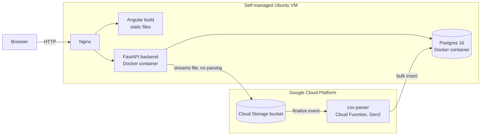

# SLA Monitoring Dashboard

A CSV of per-service health-check logs goes in; a dashboard that tells you
whether each service met its SLA, and lets you dig into the underlying
checks, comes out.

**Aim:** give teams a simple way to drop in raw, messy health-check exports
from their monitoring agents and get back a trustworthy uptime picture —
without needing to hand-clean the data first, and without the upload itself
being limited by how big the file is.

- **Upload UI + dashboard:** Angular 21 (standalone components, signals,
  Angular Material, Chart.js) — `frontend/sla-monitoring`
- **API:** FastAPI (Python 3.12, SQLModel/SQLAlchemy 2.0) — `backend/monitoring`
- **Cleaning pipeline:** a Google Cloud Function (Gen2, Python), triggered by
  Cloud Storage — `backend/cloud-functions`
- **Database:** Postgres 16 (`uploaded_files`, `service_logs`), running as a
  Docker container on the VM
- **Storage:** a Google Cloud Storage bucket for the raw CSVs

---

## Demo

| | |
| --- | --- |
|  |  |
| Upload history — every file uploaded, its processing status, and row count once cleaned. | Uploading a new CSV. Files up to 1 GB are accepted directly from the browser. |
|  |  |
| Per-file dashboard — overall + per-service uptime against the SLA target, and a daily failure-count chart. | Per-service check logs, paginated with "Show more". |
|  |  |
| `csv-parser` Cloud Function logs on GCP — request traces, plus the worker timeout/SIGKILL and DB-connection errors referenced under [Limitations](#limitations). | Cloud Run/Functions observability dashboard — request count, request latency, and end-to-end latency for the cleaning pipeline. |

## Live Link

**https://slamonitoring.hospitia.in/**

The dashboard, API, and database are all self-hosted on the same VM (see
[Architecture](#architecture)). It's a personal server rather than a managed
always-on host, so it isn't guaranteed to be running 24/7 — see
[Server Setup](#server-setup) to bring it back up if it's down.

---

## Architecture

**Upload path** — the backend never parses the file itself; it just streams
it into Cloud Storage and returns immediately:



**Read path** — the dashboard's numbers are plain aggregate queries against
already-cleaned data:



**Where things run:**



Frontend, backend, and Postgres all live on one VM behind Nginx — Postgres
runs there as its own Docker container, not a separate managed database.
The CSV parsing/cleaning step is the only piece that runs on GCP, as its
own Cloud Function.

> **Why this is decoupled the way it is:** the backend API only ever streams
> the upload straight through to Cloud Storage — it never loads the file
> into memory or parses it in the request/response cycle. Parsing and
> cleaning happen entirely in the Cloud Function, triggered after the
> upload finishes, running independently of the API's own process and
> resource limits. That's what makes it realistic to accept files up to
> **tens of GB**, not just the few-MB range a synchronous
> upload-and-parse-in-one-request design would top out at — the API's job
> is just to move bytes, not to hold the whole file in memory while
> parsing it.

### Limitations

- **No retry mechanism.** If the Cloud Function can't establish a
  connection to Postgres (e.g. a transient network blip), the event isn't
  retried, and the `uploaded_files` row is left without a clear status or
  error — from the dashboard's point of view the file just never finishes.
  This has been observed directly in production (see the "Could not
  connect to the database" and worker-timeout/SIGKILL entries in the Cloud
  Function logs under [Demo](#demo)).
- **The infrastructure is undersized for real load.** Postgres, Nginx, and
  the API all share one modest VM that hasn't been load-tested. A burst of
  concurrent large uploads or heavy query traffic could exhaust its
  CPU/memory and surface as unexpected errors rather than degrading
  gracefully.

---

## Data Cleaning

Verified against all five sample files in `data-csv/`. Handling below is
what `backend/cloud-functions/csv_cleaning.py` actually does:

1. **Normalize timestamps.** The column mixes three formats — ISO-8601 UTC,
   ISO-8601 with an explicit offset, and bare Unix epoch seconds. All three
   are parsed and converted to a single UTC timestamp before anything else
   touches the row.
2. **Normalize latency units.** Some services report latency in seconds,
   others in milliseconds — the unit varies by service, not by row. Each
   row's `latency_unit` is read and converted to a single stored
   `latency_ms`, never assumed fixed.
3. **Drop rows with missing latency.** A row with a blank latency cell
   (even with a valid status code) is dropped rather than kept with a null
   latency.
4. **Drop rows with negative latency.** Physically impossible values (e.g.
   `-286ms`) are dropped the same way.
5. **Keep the sentinel status code `999` as-is.** It isn't a real HTTP
   code, but it's stored rather than special-cased — it's automatically
   counted as a failure by the SLA math, since anything that isn't a
   2xx/3xx is treated as down.
6. **Drop exact duplicate rows.** Rows identical on every source column are
   deduplicated, keeping the first occurrence.
7. **Keep redundant multi-agent checks.** A second agent occasionally
   re-checks the same `(service, timestamp)` slot another agent already
   covered. Both readings are kept and counted independently — no
   interval-level merge is done today (see [Future Scope](#future-scope)).
8. **Sort chronologically.** Rows arrive interleaved across services and
   agents; they're sorted by the normalized timestamp before persisting.
9. **Validate structure defensively.** Required columns are checked and
   empty/malformed files are rejected with a specific error rather than
   assumed well-formed.

---

## Directory Structure

```
sla-monitoring/
├── frontend/sla-monitoring/   # Angular dashboard + upload UI
├── backend/
│   ├── monitoring/            # FastAPI API — routes, schemas, exceptions, storage
│   └── cloud-functions/       # GCP Cloud Function — CSV parsing & cleaning
├── server-setup/              # Nginx + Postgres Docker Compose, infra config
├── data-csv/                  # Sample CSVs for local testing
└── static/                    # Screenshots used in this README
```

`backend/monitoring` itself is organized by concern — `api/routes` and
`api/services` for the HTTP layer, `schemas/` for the Pydantic request/
response contracts, `exceptions/` for the centralized error handling
convention, and `storage/` for the pluggable file-storage interface (GCS
today).

---

## Future Scope

- **Connect a live monitoring agent** so checks stream in continuously and
  get processed as they arrive, instead of only via batch CSV upload.
- **Merge/dedupe logs from the same agent** — resolve the redundant-check
  overlap (Data Cleaning, step 7) into one reading per interval instead of
  counting every raw row independently.
- **A live dashboard** that updates as new checks come in, rather than only
  reflecting a file once its processing has finished.
- **A proper retry mechanism** — automatic retries with backoff for the
  Cloud Function's database connection, and a clear `error` status
  surfaced to the dashboard when it still can't connect, instead of a file
  silently getting stuck.

---

## Local Setup

**Prerequisites:** Node 20+, Python 3.12+ with [`uv`](https://docs.astral.sh/uv/),
Docker (for a local Postgres), and a GCP project with a Cloud Storage
bucket + service-account key (the storage layer only implements a GCS
provider today, so even local uploads land in a real bucket).

**1. Postgres**

```bash
docker run -d --name sla-monitoring-postgres-local \
  -e POSTGRES_USER=sla_admin \
  -e POSTGRES_PASSWORD=sla_admin_password \
  -e POSTGRES_DB=sla_monitoring \
  -p 5432:5432 \
  postgres:16
```

**2. Backend API**

```bash
cd backend/monitoring
cp .sample.env .env        # fill in GCS_BUCKET_NAME, GCS_CREDENTIALS_PATH,
                            # and the POSTGRES_* values from step 1
uv sync
uv run alembic -c monitoring/database/alembic.ini upgrade head   # creates the tables
uv run uvicorn monitoring.main:app --reload --host 127.0.0.1 --port 8123
```

`GET http://127.0.0.1:8123/api/v1/health` should return `200`; interactive
docs at `/docs`. Port `8123` matches the frontend's default
`environment.ts` — change it there if you run the API on a different port.

**3. Frontend**

```bash
cd frontend/sla-monitoring
npm install
npm start          # ng serve, http://localhost:4200
```

Upload one of the sample CSVs in `data-csv/`, wait for its status to flip
to `Success`, then click its filename to open the dashboard.

**4. Cloud Function — optional locally**

Only needed to test the parsing/cleaning step directly, without a real GCS
trigger:

```bash
cd backend/cloud-functions
cp .sample.env .env   # same POSTGRES_* values as the backend
uv sync
uv run functions-framework --target=parse_csv --debug --port 8001
```

Day-to-day frontend/backend development doesn't need this running at all —
uploads through the backend API land in the real bucket, and the deployed
function picks them up regardless of where the API is running from.

---

## Server Setup

This is how the live deployment is put together: Postgres + Nginx (and,
today, the built frontend) on one self-managed Ubuntu VM, the API as its
own Docker container on that same VM, and the Cloud Function on GCP. Full
walkthrough (domains, TCP passthrough, container networking) is in
[`server-setup/README.md`](server-setup/README.md); commands below are the
short version.

**Infrastructure (Postgres + Nginx):**

```bash
cd server-setup
cp .sample.env .env
docker network create sla-monitoring-network
docker compose -f docker-compose.yml up -d
```

**Backend API container:**

```bash
cd backend/monitoring
docker build -t sla-monitoring-backend:latest .
docker run -d --name sla-monitoring-backend \
  --network sla-monitoring-network --restart on-failure \
  --env-file /path/to/backend.env \
  sla-monitoring-backend:latest
```

**Frontend:** built in place, served directly by Nginx as static files —
no container of its own:

```bash
cd frontend/sla-monitoring
npm ci && npm run build
```

**Cloud Function:**

```bash
cd backend/cloud-functions
uv export --no-hashes --format requirements-txt --no-annotate -o requirements.txt
gcloud functions deploy csv-parser \
  --gen2 --runtime=python313 --region=us-central1 --source=. \
  --entry-point=parse_csv \
  --set-env-vars=POSTGRES_SERVER=<...>,POSTGRES_PORT=5432,POSTGRES_DB=sla_monitoring \
  --set-secrets=POSTGRES_USER=postgres-user:latest,POSTGRES_PASSWORD=postgres-password:latest \
  --trigger-event-filters="type=google.cloud.storage.object.v1.finalized,bucket=service-log-csv-store" \
  --project=<PROJECT_ID>
```

Bucket creation, IAM bindings, and Secret Manager setup for the DB
credentials are one-time steps — see
[`server-setup/README.md`](server-setup/README.md) for the full sequence.
